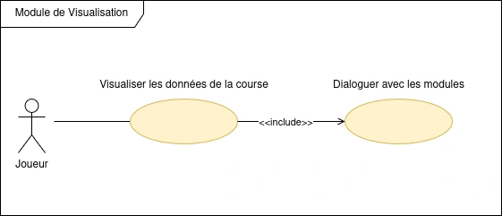
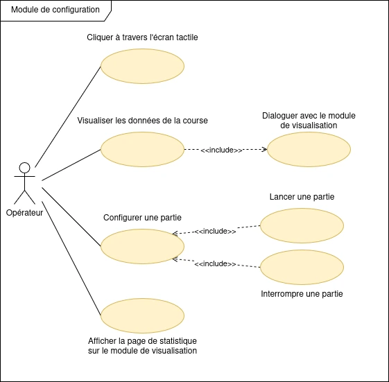
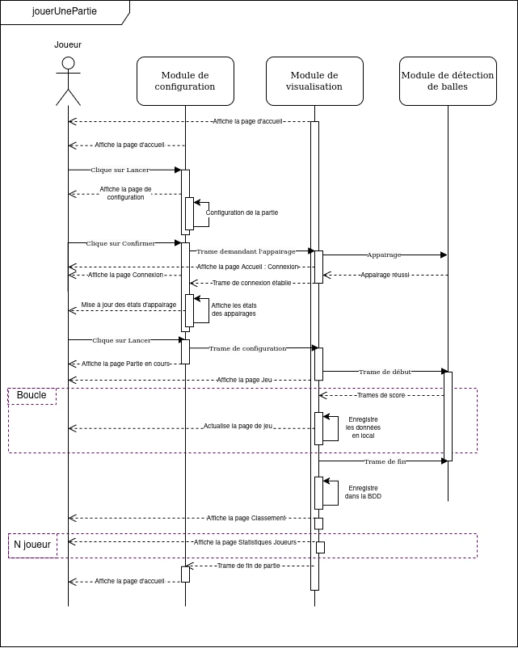

# jolly-jumpi-2025

- [Projet : Jolly-Jumpi](#jolly-jumpi-2025)
  - [Présentation](#présentation)
  - [Fonctionnalités](#fonctionnalités)
  - [Diaporama de présentation](#diaporama-de-présentation)
  - [Diagramme de séquence](#diagramme-de-séquence)
  - [Diagramme de classes](#diagramme-de-classes)
  - [Protocole de communication](#Protocole-de-communication)
  - [Visuels](#visuels)
  - [Changelog](#changelog)
  - [TODO](#todo)
  - [Planification des versions](#planification-des-versions)
  - [Défauts constatés non corrigés](#défauts-constatés-non-corrigés)
  - [Équipe de développement](#équipe-de-développement)

---

## Présentation

Jolly Jumpi est une copie du "Derby Forrain", le but : Être le premier à franchir la ligne d'arrivée en marquant des points.

Le jeu se compose de :

- 1 à 8 joueurs
- 1 piste par joueur
- 6 trous par piste (trois de 1, deux de 3 et un de 5)
- Des balles pour chaque joueur
- Plusieurs modes de jeu

Les règles sont les suivantes :

- Tirer les balles dans les trous
- Rester courtois avec les joueurs adverses

Le matériel est :

- Une télévision pour afficher le déroulement de la course et le classement/statistiques de la partie
- Une tablette afin de configurer la partie
- Un module de détection de balle

Jolly Jumpi est développé en **C++**, **QT**, **sql**.

## fonctionnalités

## Diaporama de présentation

## Diagramme de séquence

## Diagramme de classes

## Protocole de communication

## Visuels

## Changelog

## TODO

## Planification des versions

> Les versions sont numérotées de la manière suivante : `vX.YZ`
>
> - X = Mise à jour majeure
> - Y = nouvelle fonctionnalité
> - Z = Correction de bug (lettre)

- Version 0.9 : Jeu de base, JvJ

- Version 1.0 : Ajout d'un historique des parties jouées

- Version 1.1 : Ajout des différents modes de jeu.

- Version 1.2 : Modification de l'interface graphique

- Version 2.1 : Ajout d'un encodeur rotatif + bouton pour la naviguer dans l'affichage

## Défauts constatés non corrigés

## Équipe de développement

**Etudiants IR :**
- @aariati : axel.ariati.pro@gmail.com
- @npessina1 : pessina.nicolas.pro@gmail.com

---

&copy; 2024-2025 LaSalle Avignon