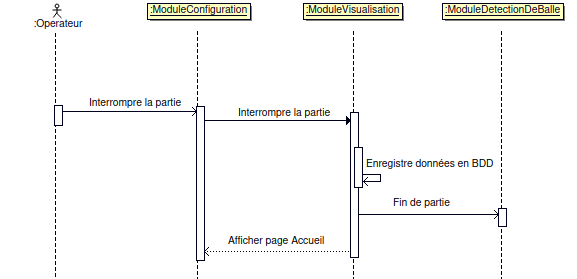

# Projet 2025 : Jolly-Jumpi

- [Projet 2025 : Jolly-Jumpi](#projet-2025--jolly-jumpi)
  - [Présentation](#présentation)
  - [Fonctionnalités](#fonctionnalités)
  - [Scénarios](#scénarios)
  - [Diagramme de classes](#diagramme-de-classes)
  - [Protocole de communication](#protocole-de-communication)
  - [Changelog](#changelog)
  - [TODO](#todo)
  - [Défauts constatés non corrigés](#défauts-constatés-non-corrigés)
  - [Équipe de développement](#équipe-de-développement)

---

## Présentation

Jolly Jumpi est un système inspiré du "Derby Forain" ou "Tiercé Forain" dont le but est d'être le premier à franchir la ligne d'arrivée en marquant des points.

Le jeu se compose de :

- 1 à 8 joueurs
- 1 piste par joueur
- 6 trous par piste (trois de 1, deux de 3 et un de 5)
- Des balles pour chaque joueur
- Plusieurs modes de jeu

Les règles sont les suivantes :

- Tirer les balles dans les trous
- Rester courtois avec les joueurs adverses

Le matériel est :

- Une télévision pour afficher le déroulement de la course et le classement (et des statistiques) de la partie
- Une tablette afin de configurer la partie
- Un module de détection de balle

Jolly Jumpi est développé en **C++** avec le _framework_ **Qt**.

## Fonctionnalités

- Le module de configuration :

- Le module de visualisation :

## Scénarios

- Configurer et gérer une partie

- Visualiser l'historique

- Interrompre une partie

## Diagramme de classes

- Module de configuration :

- Module de visualisation

## Protocole de communication

Quelques diagrammes des échanges :

## Changelog

## TODO

> Les versions sont numérotées de la manière suivante : `vX.Y.Z`
>
> - X = Mise à jour majeure
> - Y = nouvelle(s) fonctionnalité(s)
> - Z = Correction de bug

- v0.1 : Structure de base

  - Les bases

    > - [X] Créer des différents diagrammes
    > - [X] Définir le protocole de communication

  - Créer le squelette du projet

    > - [X] Créer de l'arborescence commune

  - Module de configuration : Créer la base

    > - [ ] Créer les classes
    > - [ ] Créer les attributs
    > - [ ] Créer le menu d'accueil
    > - [ ] Créer le menu de configuration

  - Module de visualisation : Créer les classes et attributs

    > - [X] Créer les classes
    > - [X] Créer les attributs

  - Module de visualisation : Créer les affichages de base

    > - [X] Créer la page Accueil
    > - [X] Créer la page Connexion
    > - [X] Créer la page Jeu
    > - [X] Créer la page Classement
    > - [X] Créer la page Statistiques:Joueur
  
  - Module de visualisation : Gérer les communications

    > - [X] Recupérer un message
    > - [X] Traiter le message
    > - [X] Formater un message à envoyer
    > - [X] Envoyer un message

- v0.2 : Jeu de base (en mode simulation)
  
  - Module de configuration :
  
    > - [ ] Personnaliser le nombre de joueurs
    > - [ ] Créer l'affichage de connexion
    > - [ ] Créer l'affichage de la partie en cours

  - Module de visualisation : Gérer partie

    - Configurer partie

      > - [X] Ajouter des joueurs (1 à 8)
      > - [X] Démarrer/Communiquer la configuration de la partie au module de détection

    - Créer chronomètre ~~et minuteur~~

      > - [X] Créer un chronomètre
      > - [ ] ~~Créer un minuteur (pour le classement et les statistiques joueur)~~
    
    - Mettre à jour l'affichage

      > - [ ] Changer de page
      > - [ ] Afficher la page Accueil
      > - [ ] Afficher la page Connexion
      > - [ ] Afficher la page Jeu
      > - [ ] Mettre à jour la page Jeu
      > - [ ] Afficher la page Classement à la fin d'une partie (10 seconde)
      > - [ ] Afficher la page Statistiques:Joueur après la page Classement (10sec par joueur)
    
    - Gérer événement partie
     
      > - [X] Calculer le score d'un joueur
      > - [ ] Enregistrer les données de la partie en local
      > - [ ] Abandonner la partie
      > - [ ] Mettre fin à la partie
      > - [X] Envoyer la fin de partie aux autres modules

- v0.3 : Ajout d'un historique des parties jouées

  - Module de visualisation : 

    > - [ ] Créer la page Statistiques:Globales
    > - [ ] Afficher la page Statistiques:Globales

- Version 0.4 : Ajout des différents modes de jeu

- Version 0.5 : Modification de l'interface graphique

- Version 1.0 : Ajout du bluetooth

## Défauts constatés non corrigés

## Équipe de développement

**Etudiants IR :**

- @aariati : axel.ariati.pro@gmail.com
- @npessina1 : pessina.nicolas.pro@gmail.com

---
&copy; 2024-2025 LaSalle Avignon
